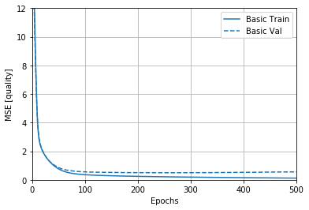

# Group Project for the class "Programming with Advanced Computer Languages"
_**Johannes Cordier and Jeremia Stalder**_

Our goal for this group project was twofold: First, we wanted to get to know Python and how to use it for a real world project. Second, we wanted to learn new machine learning techniques and directly apply them.

To learn about neural networks and random forest we used a [wine quality dataset](https://archive.ics.uci.edu/ml/datasets/wine+quality). We applied machine learning methods to predict the quality of the wine based on its physicochemical properties. We operated in the following steps:
- Import and clean the data
- Do predictions with a random forest
- Do predictions with a neural network
- Compare both results

## Data
> All data handling can be found in the file [data.ipynb](./data.ipynb)

The data consists of red and white wine. Every wine has eleven different physicochemical properties and a quality measure (based on expert reviews). We directly download the data and then check whether there are strong correlations between the covariates. Then, we check for NA values and split the data into a training and testing dataset. We save the data [here](./data/).

## Random forest
> Everything related to the random forest can be found in the file [RandomForest function.ipynb](./RandomForest%20function.ipynb)

A random forest is a procedure that consists of several uncorrelated trees on different subsets of the data and of different covariates. 
All trees have grown under a certain type of randomization during the learning process. 
The trees partition the sample in mutually exlusive groups with a top-down, greedy algorithm. 
To get the random forest prediction the one needs to compute the average prediciton over the several trees. 

Having trees with a lot of splits usually leads to overfitting and therefore to a high out-of-sample variance. 
To tackle this issue there a multiple hyperparameters that can be optimzied in-sample.

In our case we try to predict the quality of red and white wine by chemical characteristics of the respective wines. 
In the training sample we optimze the forest size, covariate selection, maximum depth of the tree, minimum sample size in a split, minimum sample size in a terminal leaf.
We tune these parameters by trying several grids of possible modelspecifications in the sample and keep the specification to predict the out-sample wine quality. 
After comparing the estimated predicitons with the actual wine quality. We estimate the mean squared error, accuracy and R-squared for the red and white wine speratly. 

The results are the following:

_Model Performance Red Wine:_
- elapsed: 22.1min finished
- Mean Squared Error: 0.2808 degrees.
- Accuracy = 94.83%.
- R-Squared = 0.56.

_Model Performance White Wine:_
- elapsed: 25.3min finished
- Mean Squared Error: 0.3348 degrees.
- Accuracy = 93.82%.
- R-Squared = 0.56.

## Neural network
> Everything related to the random forest can be found in the file [neural_net.ipynb](./neural_net.ipynb)

Neural networks work similarly to the brain. It takes inputs (in our case 11 physicochemical properties) and then feeds it to different neurons in different layers. For this we used the tensorflow keras library for python. We trained a neural network to predict the quality as accurately as possible. For this we created a neural net with 3 layers:
- Layer 1: 64 nodes of rectified linear activation functions (relu)
- Layer 2: 64 nodes of rectified linear activation functions (relu)
- Layer 3: 10 nodes of sigmoid activation functions

These 64 outputs are then condensed into one output number which represents the output. The training data is fed into the neural network for 2000 epochs, or until a stopping condition is met (the mse isn't improved in 50 epochs). The neural network tries to minimize its error by minimizing the mean square error (mse). 

As we can see in the plot, the MSE decreases significantly in the first few epochs. After this, there are only minor improvements of the mse.

We then go on to test the output with our test data. These steps are repeated for the red wine dataset and the red wine dataset separately. 

_Model Performance Red Wine:_
Testing set Mean Abs Error:  0.62 
Testing set MSE:  0.86 

_Model Performance White Wine:_
Testing set Mean Abs Error:  0.54 
Testing set MSE:  0.51 

The code for this part is losely base on: https://www.tensorflow.org/tutorials/keras/regression

## Comparison
As we can see, the random forest performs better than the neural network. This might have different reasons:
1. It might be better tuned.
2. It it is quite likely that random forests are better suited for regression tasks.
3. The sample size might be too small for the neural network.

The random forest seems to be better able to deal with outliers, as the neural net has a rather high MSE in comparison to the Mean Absolute Error.

However, both prediction methods work quite well in predicting the quality of wine based on physicochemical properties.

In case you want to know how good your wine is gonna be and you have a chemical laboratory at hand, this is a method you can use to predict the quality of your wine. Cheers!
